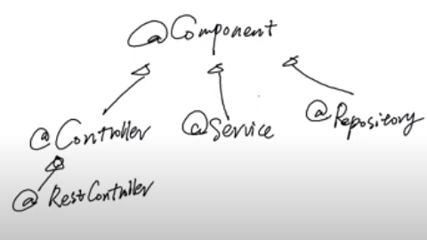
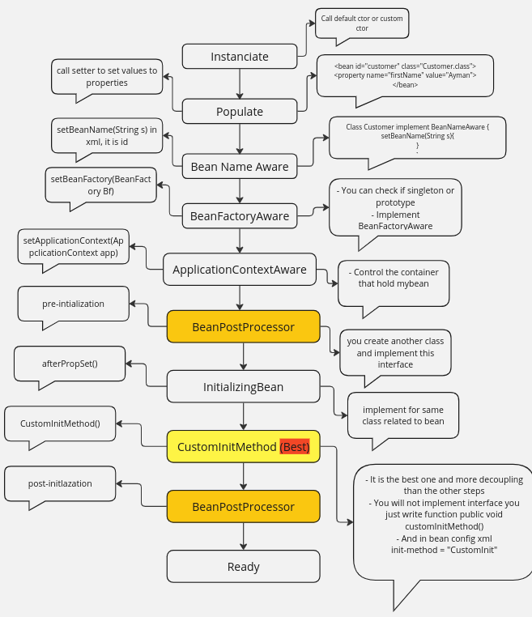
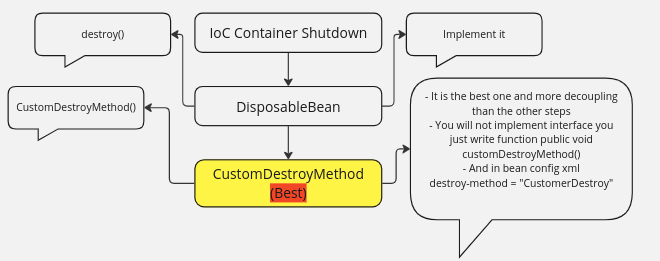

<div style="text-align: center; width:100%; display:flex; align-items: center; justify-content: center;">
  
  

</div>

# Spring Core

### Apache Maven
- Apache Maven is a software project management and comprehension tool. Based on the concept of a project object model (POM), Maven can manage a project's build, reporting and documentation from a central piece of information.


#### 1- Install Maven tool -like npm- help you mange your dependancies and install required JARS.

```bash
sudo apt install maven
```

#### 2- Create Maven Project 

```bash
mvn archetype:generate -DgroupId=com.example -DartifactId=my-app -DarchetypeArtifactId=maven-archetype-quickstart -DinteractiveMode=false
```
<strong>archetype:generate</strong>Tempalte for web application.

<strong>DgroupId</strong>
- Uniquly identified project across all projects.
- groupId should follow java package name rule.
- It is typically follow the reverse domain name convention to ensure uniqueness.
- For example my domain name is moAymanBackend.com so groupId will be com.moAymanBackend

<strong>DarchetypeArtifactId=maven-archetype-quickstart </strong> 
This is a property defining which archetype to use for project generation. The archetype defines the structure and basic contents of the project.

DartifactId=my-app

<strong>DartifactId:</strong> 
This is a property defining the Artifact ID for the new project. The Artifact ID is the name of the project.
my-app: This is the value of the Artifact ID. It's the name of your project and will also be used as the name of the directory where your project files will be created.


#### 3. Add Spring Core Dependencies

1. **Open Maven Repository**: Visit the Maven repository website (e.g., [Maven Central](https://search.maven.org/)).

2. **Search for Spring Context**: Use the search feature to find the Spring Context dependency.

3. **Choose the Version You Want**: Select the appropriate version for your project.

4. **Copy Maven XML Tag**: Copy the Maven XML dependency tag for Spring Context.

5. **Paste it in `pom.xml` File**: Add the copied XML tag to the `<dependencies>` section of your `pom.xml` file.


 
```xml
<!-- https://mvnrepository.com/artifact/org.springframework/spring-core -->
<!-- https://mvnrepository.com/artifact/org.springframework/spring-context -->
<dependency>
    <groupId>org.springframework</groupId>
    <artifactId>spring-context</artifactId>
    <version>6.1.10</version>
</dependency>
```
Why add spring-context not spring core ?


The `spring-context` module builds on top of `spring-core` and provides more advanced features that are commonly used in enterprise applications.

### Spring Core
- **Core Container (BeanFactory)**: The foundational component for managing beans and their dependencies.
- **Core Utilities**: Various utilities and helper classes.
- **Spring Expression Language (SpEL)**: A powerful expression language for querying and manipulating an object graph at runtime.

### Spring Context
The `spring-context` module builds on `spring-core` and provides additional advanced features, including:

- **ApplicationContext**: An extension of the BeanFactory that supports:
  - **Internationalization (i18n)**: Support for internationalization of messages.
  - **Event Propagation**: Built-in eventing capabilities.
- **Aspect-Oriented Programming (AOP)**: Integration with Spring AOP for applying aspects such as transaction management and security.

### Dependencies
As `spring-context` depends on `spring-core`, `spring-beans`, `SpEL`, and `spring-aop`, adding `spring-context` to your project will automatically include all these dependencies via the Maven tool.


As shown in the previous picture, AOP is not a container like Spring Core, beans, context, and SpEL, which are IoC containers. This means that while AOP integrates with the IoC container, it is not an IoC container itself.


#### 4- Tell bean container to initialize your beans
Create xml file in which you will spring `Application Context` which beans and configuration you want initialize or add.

Go to <a href="https://docs.spring.io/spring-framework/reference/core/beans/factory-scopes.html">Spring Application Context XML Configuration.</a>

```xml
<bean id="myBean" class="com.example.EmailService"></bean>
```
### ID attribute 
 This ID can be used to inject the bean into other beans or to look it up programmatically.

### Class attribute
tell the Spring IoC container which class to instantiate and manage as a bean.

```java
import org.springframework.beans.factory.BeanFactory;
import org.springframework.context.support.ClassPathXmlApplicationContext;

/**
 * Hello world!
 *
 */
public class App 
{
    public static void main( String[] args )
    {
        //! Now we do not need instantite explicitly 
        //! EmailService emailService = new EmailService();
        BeanFactory beanFactoryInstance = new ClassPathXmlApplicationContext("spring.xml");
        EmailService emailService = beanFactoryInstance.getBean("myBean", EmailService.class);
        emailService.sendEmail("mo@gmail.com", "hello from mo");
    }
}
```
- You tell BeanFactory where is the file that in it you tell him how Factory will make my object.

```java
BeanFactory beanFactoryInstance = new ClassPathXmlApplicationContext("spring.xml");
```

- getBean(The name of the id in bean tag, Type of object)

```xml
<bean id="myBean" class="com.example.EmailService"></bean>
```
- It is most recommended using ApplicationContext instead beansFactory

```java
        ApplicationContext context = new ClassPathXmlApplicationContext("spring.xml");
        EmailService emailService = context.getBean("email", EmailService.class);
```

- To Make Maven resolve and compile dependancies
You must cd at your project `DartifactId`
```bash
mvn clean package
```
- At the most you will counter this problem and this because we did not specify a specific version of JDK for Maven,
so Maven will work with its default JDK.


- The solution is adding in pom.xml file the JDK you use.

- Visit <a href="https://maven.apache.org/plugins/maven-compiler-plugin/examples/set-compiler-source-and-target.html">Apache Maven Compiler Plugin</a>


- Add this tag to tell maven you need JDK 17
```xml
 <build>
    <plugins>
      <plugin>
        <groupId>org.apache.maven.plugins</groupId>
        <artifactId>maven-compiler-plugin</artifactId>
        <version>3.13.0</version>
        <configuration>
          <source>17</source>
          <target>17</target>
        </configuration>
      </plugin>
    </plugins>
     <plugin>
      <groupId>org.codehaus.mojo</groupId>
      <artifactId>exec-maven-plugin</artifactId>
      <version>3.0.0</version>
      <configuration>
        <mainClass>com.example.App</mainClass> 
      </configuration>
    </plugin>
  </build>
```
- Done :+1:

- To run Maven app 
First you must include another plugin
```xml
 <plugin>
            <groupId>org.codehaus.mojo</groupId>
            <artifactId>exec-maven-plugin</artifactId>
            <version>3.3.0</version>
            <configuration>
                <mainClass>com.example.App</mainClass>
            </configuration>
        </plugin>
```
- To make you use the below command
```bash
mvn exec:java 
```
- Take care in mainClass tag you must add your main class path.


##  Configration Class
#### Instead Using xml to tell maven which object type and config i want to instanciate you can use configuration class.

- Add AppConfig class inside Config package.

- Add @Configuration annotation
```java
package com.example.Config;

import org.springframework.context.annotation.Bean;
import org.springframework.context.annotation.Configuration;

import com.example.EmailService;

@Configuration
public class AppConfig {
    

    @Bean
    public EmailService emailService(){
        return new EmailService();
    }

}
```
- In main class how get your bean from BeanFactory or ApplicationContext


__________________________________________________________________________________________________


## Spring Bean Scopes

### Overview

Spring provides different scopes for defining the lifecycle and visibility of beans. Here are the six scopes available:

1. **Singleton (default)**
2. **Prototype (Per instance per bean request)**
3. **Request (specific to web-aware Spring ApplicationContexts)**
4. **Session (specific to web-aware Spring ApplicationContexts)**
5. **Application (specific to web-aware Spring ApplicationContexts)**
6. **WebSocket (specific to web-aware Spring ApplicationContexts)**

### 1. Singleton (default)

- **Definition**: A `single instance` of the bean is created for the entire Spring container. This instance is shared and reused wherever it is needed.
- **Lifecycle**: The bean is instantiated when the Spring container is created, and it is destroyed when the container is destroyed.

**Example:**

In `spring.xml`:
```xml
<bean id="emailService" class="com.example.EmailService"></bean>
```

Create two `ApplicationContext` instances:
```java
ApplicationContext ctx1 = new ClassPathXmlApplicationContext("spring.xml");
ApplicationContext ctx2 = new ClassPathXmlApplicationContext("spring.xml");

EmailService emailService1 = ctx1.getBean("emailService", EmailService.class);
EmailService emailService2 = ctx2.getBean("emailService", EmailService.class);

// There are two different instances of the application contexts
```

### 2. Prototype (Per instance per bean request)

- **Definition**: A new instance of the bean is created each time it is requested from the Spring container.
- **Lifecycle**: The bean is instantiated every time it is requested. Spring does not manage the lifecycle of prototype beans after creation.

**Example:**

**i. XML Configuration:**
```xml
<bean id="myPrototypeBean" class="com.example.MyPrototypeBean" scope="prototype" />
```

**ii. Configuration Class:**
```java
@Bean
@Scope("prototype")
public MyPrototypeBean myPrototypeBean() {
    return new MyPrototypeBean();
}
```

### When to Use

- **Singleton**: Suitable for stateless beans and shared resources.
- **Prototype**: Suitable for stateful beans, where different instances are required for different clients.

Understanding these scopes is crucial for designing your application with the appropriate lifecycle and performance considerations in mind.


In summary if you make that 
```java
ApplicationContext context = new ClassPathXmlApplicationContext("spring.xml");
        EmailService emailService = context.getBean("myBean", EmailService.class);
        EmailService emailService3 = context.getBean("myBean", EmailService.class);
        System.out.println(emailService == emailService3);
```
output will be true, that is mean it exist only one instance from my bean even if i call get bean it will make another reference to the the same object.
while
```java
@Configuration
public class AppConfig {
    

    @Bean
    public EmailService emailService(){
        return new EmailService();
    }

     @Bean
        @Scope("prototype")
    public EmailService emailServiceTwo(){
        return new EmailService();
    }

}
```
```java
ApplicationContext context2 = new AnnotationConfigApplicationContext(AppConfig.class);
        EmailService emailService5 = context2.getBean("emailServiceTwo", EmailService.class);
        EmailService emailService6 = context2.getBean("emailServiceTwo", EmailService.class);
```
output will be false, so foreach call BeansFactory throw another object.

### 3. Request (specific to web-aware Spring ApplicationContexts)
- It means that this type of bean scope aware abot web (HTTP request) so for each request will create another object.
- **Definition**: A `single instance` of the bean is created for the entire Spring container. This instance is shared and reused wherever it is needed.
- **Lifecycle**: The bean is instantiated when the Spring container is created, and it is destroyed when the container is destroyed.

### 4. Session (specific to web-aware Spring ApplicationContexts)
- Per instance per HTTP session.

### 5. Application (specific to web-aware Spring ApplicationContexts)
- Per instance per Servlet Context.
- In one web application you have only one ServletContext but in one web application you might have multiple ApplicationContext
```java
ApplicationContext ctx1 = new ClassPathXmlApplicationContext("spring.xml");
ApplicationContext ctx2 = new ClassPathXmlApplicationContext("spring.xml");

EmailService emailService1 = ctx1.getBean("emailService", EmailService.class);
EmailService emailService2 = ctx2.getBean("emailService", EmailService.class);

System.out.println(emailService1 == emailService2); // Output: false
```

### 6. WebSocket (specific to web-aware Spring ApplicationContexts)

### 7. Custom Scope

______________________________________________

## Spring Bean Scopes (via annotation)
- There are three ways to ask IoC container to instanciate your beans (object). We talked before about xml, AppConfig. Now we will talk about annotation -the third way- to ask IoC container -ApplicationContext- to instanciate your beans. 
- Annotation is added in `Spring 2.5.x` while AppConfig is added in `Spring 3.x.x`

- But Actually we have two ways not three, as we can not use annotation without AppConfig or xml.

### 1- Add @Component annotation at the class you want it be instanciated.

```java
@Component
public class SMSService {
    public void sendMessage(String reciever, String message){
        System.out.println(message + "is being" + reciever);
    }
}
```
### 2- Add @ComponentScan for config class
```java
@Configuration
//! Component Scan take array of packages to scan them and when find @Component there it will instanciate this class
//! It helps spring not to scan all packages
@ComponentScan({"com.example.Annotations"})
public class MyAppConfig {
    
}
```
- It is very helpful for spring instead scan all package, spring will only scan this package and manage beans for class that is annotated only with @Component annotation

### 3- Instanciate Bean using IoC container

```java
ApplicationContext context = new AnnotationConfigApplicationContext(MyAppConfig.class);
        SMSService smsService =  context.getBean(SMSService.class);
        smsService.sendMessage("ay", "7aga");
```
- If you want retrieve by name like that 

```java
        SMSService smsService =  context.getBean("myCustomService",SMSService.class);
```

- You must go to component and identify this custom name

```java
      @Component("myCustomService")
      public class SMSService {
          public void sendMessage(String reciever, String message){
              System.out.println(message + "is being" + reciever);
          }
      }
```

- Or you can use default name for class name.

### 4- Usng xml instead of AppConfig
- To achieve **Component Based Annotation** using xml 
Use NameSpace Declaration `xmlns:context`
for Schema Location `"http://www.springframework.org/schema/context"`

Modifiy Schema location for Namespace `xsi:schemaLocation` as shown below
```xml
<?xml version="1.0" encoding="UTF-8"?>
<beans xmlns="http://www.springframework.org/schema/beans"
	xmlns:xsi="http://www.w3.org/2001/XMLSchema-instance"
	xmlns:context="http://www.springframework.org/schema/context"
	xmlns:aop="http://www.springframework.org/schema/aop"
    xsi:schemaLocation="http://www.springframework.org/schema/beans
    https://www.springframework.org/schema/beans/spring-beans.xsd
    http://www.springframework.org/schema/context
    https://www.springframework.org/schema/context/spring-context.xsd">

  <context:component-scan base-package="com.example.Annotations"/>
</beans>
```
### 5- you can instanciate your context
 
 ```java
         ApplicationContext context2 = new ClassPathXmlApplicationContext("spring-annotations.xml");
 ```

## Component Based Annotaions


- If you start your application, spring will try to instinciate beans for classes that is annotated with those annotations.

- **@Controller** If you anotate with @Controller, that means you will have method anotated with @GetMapp. (Presenation layer)

- **@Service** It deos not add extra functionality like @Controller `@GetMapping` method instead it is a declarative for developer that we are in service layer.

- **@Repository** DAO layer. That class using in `Connect database` or `Making crud operations`. It is add extra functionality

- It will convert those different exceptions thrown by different vendors `SQL Server` or `Oracle` like `Primary Key is duplicate` to be generic one 

- **RestController** When using rest controller


## Spring Bean Lifecycle (Creation)



- If you want add customized code during beans creation.

### 1- Implement Aware Interfaces.
- To rebulid maven 

### 2- Implemet IntialzingBean Interface.
### 3- Custom-Init method
### 4- @PostConstructor and `@PreDestroy`

## Spring Bean Lifecycle (Destruction)



## Spring Bean Lifecycle - In code

#### 1- Instanciate 
- If  you want not to call non-argument ctor and call another one, you must make that explicitly.
DisposableBean
- We need call this non-args ctor.
```java
public Customer(String firstName) {
        System.out.println("First Name Ctor");
        this.firstName = firstName;
    }
```
- in xml
```xml
<bean id="cust" class="com.example.Bean_Life_Cycle.Customer">
		<constructor-arg name="firstName" value="Ayman"/>
	</bean>
```

#### 2- Populate

- If you want call the property setter

```xml
<bean id="cust" class="com.example.Bean_Life_Cycle.Customer">
		<constructor-arg name="firstName" value="Ayman"/>
		<property name="firstName" value="DevMo"/>
	</bean>
```
#### 3- BeansNameAware

```java
package com.example.Bean_Life_Cycle;

import org.springframework.beans.BeansException;
import org.springframework.beans.factory.BeanFactory;
import org.springframework.beans.factory.BeanFactoryAware;
import org.springframework.beans.factory.BeanNameAware;
import org.springframework.context.ApplicationContext;
import org.springframework.context.ApplicationContextAware;

public class Customer implements BeanNameAware,BeanFactoryAware, ApplicationContextAware {
    
    private String firstName;

    public Customer() {
        System.out.println("non-args ctor");
    }

    public Customer(String firstName) {
        System.out.println("First Name Ctor");
        this.firstName = firstName;
    }

    public String getFirstName() {
        return firstName;
    }

    public void setFirstName(String firstName) {
        System.out.println("Set First Name");
        this.firstName = firstName;
    }

    @Override
    public void setBeanName(String name) {
        System.out.println("setBeanName" + name);
    }

    @Override
    public void setBeanFactory(BeanFactory beanFactory) throws BeansException {
        System.out.println("setBeanFactoy" + beanFactory.isSingleton(("cust")));
    }

    @Override
    public void setApplicationContext(ApplicationContext applicationContext) throws BeansException {
        System.out.println("setApplicationContext"+ applicationContext.isPrototype("cust"));
    }
}
```

#### 4- IntializingBean Interface

```java
package com.example.Bean_Life_Cycle;

import org.springframework.beans.BeansException;
import org.springframework.beans.factory.BeanFactory;
import org.springframework.beans.factory.BeanFactoryAware;
import org.springframework.beans.factory.BeanNameAware;
import org.springframework.beans.factory.InitializingBean;
import org.springframework.context.ApplicationContext;
import org.springframework.context.ApplicationContextAware;

public class Customer implements BeanNameAware,BeanFactoryAware, ApplicationContextAware, InitializingBean {
    
    private String firstName;

    public Customer() {
        System.out.println("non-args ctor");
    }

    public Customer(String firstName) {
        System.out.println("First Name Ctor");
        this.firstName = firstName;
    }

    public String getFirstName() {
        return firstName;
    }

    public void setFirstName(String firstName) {
        System.out.println("Set First Name" + firstName);
        this.firstName = firstName;
    }

    @Override
    public void setBeanName(String name) {
        System.out.println("setBeanName" + name);
    }

    @Override
    public void setBeanFactory(BeanFactory beanFactory) throws BeansException {
        System.out.println("setBeanFactoy" + beanFactory.isSingleton(("cust")));
    }

    @Override
    public void setApplicationContext(ApplicationContext applicationContext) throws BeansException {
        System.out.println("setApplicationContext"+ applicationContext.isPrototype("cust"));
    }

    @Override
    public void afterPropertiesSet() throws Exception {
        this.firstName = "Ayman after property set";
    }
}
```


#### 5- BeanPostProcessor Interface
 - You will create another class. You will not implement BeanPostProcessor.

 ```java
 package com.example.Bean_Life_Cycle;

import org.springframework.beans.BeansException;
import org.springframework.beans.factory.config.BeanPostProcessor;

public class CustomBeanPostProcessor implements BeanPostProcessor {
    @Override
	public Object postProcessBeforeInitialization(Object bean, String beanName) throws BeansException {
        System.out.println("postProcessBeforeInitialization" + beanName);
		return bean;
	}
    @Override
	public Object postProcessAfterInitialization(Object bean, String beanName) throws BeansException {
        System.out.println("postProcessAfterInitialization" + beanName);
        return bean;
	}
}
 ```
- Second step you have to register it.
- You have **Two ways to register**

##### 1- First Way using xml tag 
```xml
 	 <bean id="custmoerPostBeanProcessor" class="com.example.Bean_Life_Cycle.CustomBeanPostProcessor"/>
```
 ```xml
<?xml version="1.0" encoding="UTF-8"?>
<beans xmlns="http://www.springframework.org/schema/beans"
	xmlns:xsi="http://www.w3.org/2001/XMLSchema-instance"
	xmlns:context="http://www.springframework.org/schema/context"
	xmlns:aop="http://www.springframework.org/schema/aop"
    xsi:schemaLocation="http://www.springframework.org/schema/beans
                           https://www.springframework.org/schema/beans/spring-beans.xsd
                           http://www.springframework.org/schema/context
                           https://www.springframework.org/schema/context/spring-context.xsd">
  <context:component-scan base-package="com.example.Bean_Life_Cycle"/>


	 <bean id="custmoerPostBeanProcessor" class="com.example.Bean_Life_Cycle.CustomBeanPostProcessor"/>

</beans>
```


##### 2- Second Way using annotation with xml 

```xml
<?xml version="1.0" encoding="UTF-8"?>
<beans xmlns="http://www.springframework.org/schema/beans"
	xmlns:xsi="http://www.w3.org/2001/XMLSchema-instance"
	xmlns:context="http://www.springframework.org/schema/context"
	xmlns:aop="http://www.springframework.org/schema/aop"
    xsi:schemaLocation="http://www.springframework.org/schema/beans
                           https://www.springframework.org/schema/beans/spring-beans.xsd
                           http://www.springframework.org/schema/context
                           https://www.springframework.org/schema/context/spring-context.xsd">
  <context:component-scan base-package="com.example.Bean_Life_Cycle"/>


	 <!-- <bean id="custmoerPostBeanProcessor" class="com.example.Bean_Life_Cycle.CustomBeanPostProcessor"/> -->

</beans>
```
- Using `@Component` annotation with the `CustomBeanPostProcess` class

```java
package com.example.Bean_Life_Cycle;

import org.springframework.beans.BeansException;
import org.springframework.beans.factory.config.BeanPostProcessor;

@Component
public class CustomBeanPostProcessor implements BeanPostProcessor {
    @Override
	public Object postProcessBeforeInitialization(Object bean, String beanName) throws BeansException {
        System.out.println("postProcessBeforeInitialization" + beanName);
		return bean;
	}
    @Override
	public Object postProcessAfterInitialization(Object bean, String beanName) throws BeansException {
        System.out.println("postProcessAfterInitialization" + beanName);
        return bean;
	}
}
```

#### 1- DisposableBean Interface

```java
package com.example.destruction;

import org.springframework.beans.factory.DisposableBean;

public class CustomerDest implements DisposableBean{

    @Override
    public void destroy() throws Exception {
        System.out.println("DisposableBean");
    }
    
}
```
- You must shut down the ApplicationContext that holds that bean to call destroy method.

```java
package com.example;

import org.springframework.context.ApplicationContext;
import org.springframework.context.annotation.AnnotationConfigApplicationContext;
import org.springframework.context.support.AbstractApplicationContext;
import org.springframework.context.support.ClassPathXmlApplicationContext;

import com.example.Annotations.MyAppConfig;
import com.example.Annotations.SMSService;
import com.example.Bean_Life_Cycle.Customer;
import com.example.Config.AppConfig;

/**
 * Hello world!
 *
 */
public class App 
{
    public static void main( String[] args )
    {
        ApplicationContext context2 = new ClassPathXmlApplicationContext("spring-annotations.xml");
       
        ((AbstractApplicationContext)context2).registerShutdownHook();
    }
}
```

#### 2- Custom Destroy Method
- This is best method to overload as it is not coupled to my bean.
-As You will not implement interface for this method

##### 1- Define your function inside your bean class -You will not need to implement method-

```java
package com.example.destruction;

import org.springframework.beans.factory.DisposableBean;

public class CustomerDest implements DisposableBean{

    @Override
    public void destroy() throws Exception {
        System.out.println("DisposableBean");
    }

    public void customDestroy(){
        System.out.println("Custom Destroy");
    }
    
}
```

##### 2- Register your function -Like you register your init function-

```xml
	 <bean id="customerDest" class="com.example.Bean_Life_Cycle.CustomDest" destroy-method="customDestroy"/>
```

##### 3- Shutdown your container

#### 2- Custom Destroy Method (Using annotation)

- Instead register desreoy using attribute `destroy-method` use this annotation `PreDestroy`
```java
 @PreDestroy
    public void customDestroy(){
        System.out.println("Custom Destroy");
    }
```
- Take care that in way `PreDestroy` annotation the order will be reversed it will 

`ShtdownDown IoC` -> `PreDestroy` -> `DisposableBean`

- Take care that IoC will not destroy `Prototype Scope's Bean` as IoCinitialize prototype and then not keep its refernce inside container as it is too many references may be.

### Java Config

- You can use app config to register customInit and customDestroy.

- If you open `@Bean` class annotation will find that you can use it to register these two function.

```java
@Target({ElementType.METHOD, ElementType.ANNOTATION_TYPE})
@Retention(RetentionPolicy.RUNTIME)
@Documented
public @interface Bean {

	/**
	 * Alias for {@link #name}.
	 * <p>Intended to be used when no other attributes are needed, for example:
	 * {@code @Bean("customBeanName")}.
	 * @since 4.3.3
	 * @see #name
	 */
	@AliasFor("name")
	String[] value() default {};

	@AliasFor("value")
	String[] name() default {};

	boolean autowireCandidate() default true;

	String initMethod() default "";

	String destroyMethod() default AbstractBeanDefinition.INFER_METHOD;

}
```
- In my bean class i will define this `customDestroy` or `customInit` function

```java
 public void customInit  (){
            System.out.println("Customer init........");
    }
```

- In `AppConfig` you can register using `@Bean` annotations.

```java
@Configuration
@ComponentScan({"com.example.destruction"})
public class AppConfig {
    @Bean(initMethod= "customMethod")
    public Customer customer(){return new Customer();}
}
```
- **Or You can use `ComponentScan`** with `@PostConstruct` annotation above customInit method


### Bean AutoWiring
- It is very logic taht your classes in your project needing to be interconnected to eachothers.
- And maybe some bean depen on another one. How we resolce that?
- We need Spring resolve and inject this bean to another one this behaviour is done by spring `autowiring` `wiring`
- Look at below image and see how objects are wired together. It is complex. is not it?
- `AutoWiring` will solve this away from us

- There are `Four` type for this `Autwiring`

##### 1- no
- Spring does not do dependancy injection automatically for you. Instead  you have to wire this bean by yourself by **XML** 


##### 2- byName
- It will match based on property name and bean name
```xml
<?xml version="1.0" encoding="UTF-8"?>
<beans xmlns="http://www.springframework.org/schema/beans"
	xmlns:xsi="http://www.w3.org/2001/XMLSchema-instance"
	xmlns:context="http://www.springframework.org/schema/context"
	xmlns:aop="http://www.springframework.org/schema/aop"
    xsi:schemaLocation="http://www.springframework.org/schema/beans
                           https://www.springframework.org/schema/beans/spring-beans.xsd
                           http://www.springframework.org/schema/context
                           https://www.springframework.org/schema/context/spring-context.xsd">
        <bean id="customerService" class="main.java.com.customer.CustomerService" autowire="byName"></bean>
        <bean id="customerDao" class="main.java.com.customer.CustomerDao"></bean>
    
</beans>
```

```java
package main.java.com.customer;

public class CustomerService {
    
    private CustomerDao customerDao;

    public CustomerService() {
        System.out.println("default ctor");
    }
    public CustomerDao getCustomerDao(){
        return customerDao;
    }

    public void setCustomerDao(CustomerDao customerDao){
        System.out.println("SetCustomerDaoter");
        this.customerDao = customerDao;
    }
}
```

-Do not forget to implement setter method for dependancy as it will be used by `autowire`

- Now bean will look at **the name** this dependancy `private CustomerDao customerDao` and try to find another bean in its container with this name `with id`

##### 3- byType -Default in java config-
- Find one bean with the same type of the property
```xml
<bean id="customerService" class="main.java.com.customer.CustomerService" autowire="byType"></bean>
```
- Search for any bean of type `CustomerDao`.
- **I think you notice the issue here "What if i hava more than bean of the same type and my class depend on that class?"**
- You will have exception, You must have one

##### 4- Ctor : byType
- Like the`byType`
<bean id="customerService" class="main.java.com.customer.CustomerService" autowire="constructor"></bean>
```
- But must find customized ctor  for instanciate dependancey using ctor not from setter and if you does not make customized ctor to instanciate the dependancy and using setter like `byType` it will work no execption will be but dependancy will not be resolved

```java
 public CustomerService(CustomerDao customerDao) {
        this.customerDao = customerDao;
    }
```
- But unlike `byType` If you have more than one bean, it will not throw exception instead dependancy will not been resolved, but if the same of argument in ctor the same as one in id of that bean it will resolved. **That is difference between `byType` and `construcor` `autowiring`**

### AutoWired annotation

#### 1- Property based dependancy injection
- Annotate Service class with `@Service`
- Annotate property dependant with `@AutoWired`
```java
package main.java.com.customer;
import org.springframework.stereotype.Service;


@Service
public class CustomerService {
    
    @Autowired
    private CustomerDao customerDao;


    public CustomerDao getCustomerDao(){
        return customerDao;
    }

   
}
```
- Tell AppConfig to scan for component annotation or any other its subAnnotation `@Service` `@Repository`
```java
package main.java.com.customer;

@Configuration
@ComponentScan("main.java.com.customer")
public class AppConfig {
    
}
```
- Annotate dependant class with `@Repository`.
```java
package main.java.com.customer;
import org.springframework.stereotype.Repository;

@Repository
public class CustomerDao {
    
}
```

- **This type may be led to circle dependancy issue, you will need using mockito to unit testing**


#### 2- Setter Based dependancy injection
```java
package main.java.com.customer;
import org.springframework.stereotype.Service;


@Service
public class CustomerService {
    
    private CustomerDao customerDao;

    public CustomerService() {
        System.out.println("default ctor");
    }
    public CustomerDao getCustomerDao(){
        return customerDao;
    }

    @Autowired
    public void setCustomerDao(CustomerDao customerDao){
        System.out.println("SetCustomerDaoter");
        this.customerDao = customerDao;
    }
}
```

- As setter is public, `setter based dependancy injection` not widely use as it violate encapuslation issue.

- Setter is `good` at `Circle dependancy`

#### 3- Constructor Based dependancy injection (Best for testing -Junit-)

```java
//  @Autowired
    public CustomerService(CustomerDao customerDao) {
        this.customerDao = customerDao;

    }
```
- If can not use `@Autowired` in `constructor based`
- If you have `default ctor` spring will use default one, but if you want to use another custom one use `@Autoweired`

- ByDefault `@Autowired` is used `byType`, What if i have multiple instance `Beans` of same dependant class.

### Bean Conflict `@Qualifier`
- Now we have two implementations for `CustomerDao`.

- As you have two implenentaion at same scanned package for same type -interface- `CustomerDao`

-If you run, execption will be thrown.
`expected at least 1 bean which qualifies as autowire candidate`

- In prooerty based you must annotate one of implementaions at least as `@Repository`.

- Uou must Qualifiy one of them in service class 

```java
package com.customer;
import org.springframework.beans.factory.annotation.Autowired;
import org.springframework.beans.factory.annotation.Qualifier;
import org.springframework.stereotype.Service;


@Service
public class CustomerService {
    //! Default name, first name is lowercase but you can give repository custom name
    @Qualifier("customerDaoImpl")
    private CustomerDao customerDao;

    public CustomerService() {
        System.out.println("default ctor");
    }

    // @Autowired
    public CustomerService(CustomerDao customerDao) {
        this.customerDao = customerDao;

    }

    public CustomerDao getCustomerDao(){
        return customerDao;
    }

    public void setCustomerDao(CustomerDao customerDao){
        System.out.println("SetCustomerDaoter");
        this.customerDao = customerDao;
    }
}
```

### @Component vs @Bean

- `@Component` annotation has variations `@Service` `@Controller` `@Repository` and `@RestController`

- #### 1- `@Component` based annotation 
Apply on the class level, there is an implicit one-to-one mapping between bean name and bean, container will have one instance and its name default name

- #### 2- `@Bean` based annotaion
- Applying on method at `AppConfig`.
- The bean name is the method name.

### `@Configuration` Annotation.