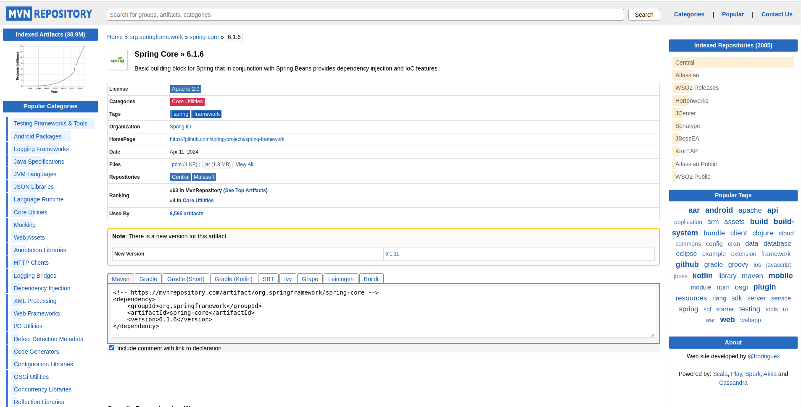
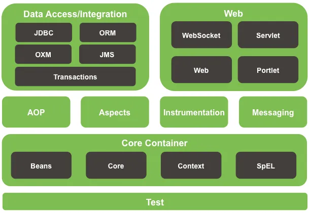
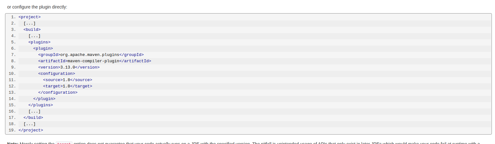
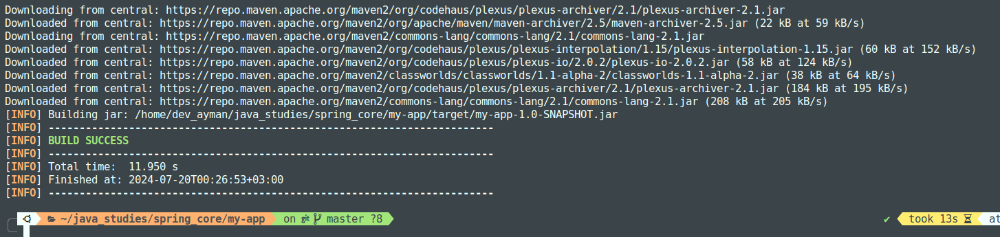
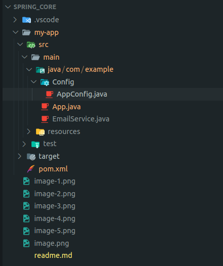
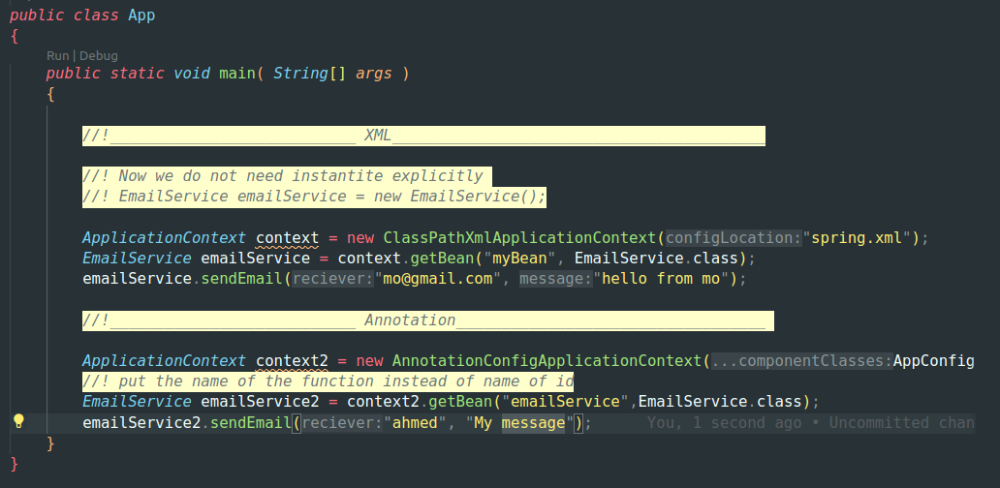

<div style="text-align: center; width:100%; display:flex; align-items: center; justify-content: center;">
  
  
</div>

# Spring Core

### Apache Maven
- Apache Maven is a software project management and comprehension tool. Based on the concept of a project object model (POM), Maven can manage a project's build, reporting and documentation from a central piece of information.


#### 1- Install Maven tool -like npm- help you mange your dependancies and install required JARS.

```bash
sudo apt install maven
```

#### 2- Create Maven Project 

```bash
mvn archetype:generate -DgroupId=com.example -DartifactId=my-app -DarchetypeArtifactId=maven-archetype-quickstart -DinteractiveMode=false
```
<strong>archetype:generate</strong>Tempalte for web application.

<strong>DgroupId</strong>
- Uniquly identified project across all projects.
- groupId should follow java package name rule.
- It is typically follow the reverse domain name convention to ensure uniqueness.
- For example my domain name is moAymanBackend.com so groupId will be com.moAymanBackend

<strong>DarchetypeArtifactId=maven-archetype-quickstart </strong> 
This is a property defining which archetype to use for project generation. The archetype defines the structure and basic contents of the project.

DartifactId=my-app

<strong>DartifactId:</strong> 
This is a property defining the Artifact ID for the new project. The Artifact ID is the name of the project.
my-app: This is the value of the Artifact ID. It's the name of your project and will also be used as the name of the directory where your project files will be created.


#### 3. Add Spring Core Dependencies

1. **Open Maven Repository**: Visit the Maven repository website (e.g., [Maven Central](https://search.maven.org/)).

2. **Search for Spring Context**: Use the search feature to find the Spring Context dependency.

3. **Choose the Version You Want**: Select the appropriate version for your project.

4. **Copy Maven XML Tag**: Copy the Maven XML dependency tag for Spring Context.

5. **Paste it in `pom.xml` File**: Add the copied XML tag to the `<dependencies>` section of your `pom.xml` file.



 
```xml
<!-- https://mvnrepository.com/artifact/org.springframework/spring-core -->
<!-- https://mvnrepository.com/artifact/org.springframework/spring-context -->
<dependency>
    <groupId>org.springframework</groupId>
    <artifactId>spring-context</artifactId>
    <version>6.1.10</version>
</dependency>
```
Why add spring-context not spring core ?



The `spring-context` module builds on top of `spring-core` and provides more advanced features that are commonly used in enterprise applications.

### Spring Core
- **Core Container (BeanFactory)**: The foundational component for managing beans and their dependencies.
- **Core Utilities**: Various utilities and helper classes.
- **Spring Expression Language (SpEL)**: A powerful expression language for querying and manipulating an object graph at runtime.

### Spring Context
The `spring-context` module builds on `spring-core` and provides additional advanced features, including:

- **ApplicationContext**: An extension of the BeanFactory that supports:
  - **Internationalization (i18n)**: Support for internationalization of messages.
  - **Event Propagation**: Built-in eventing capabilities.
- **Aspect-Oriented Programming (AOP)**: Integration with Spring AOP for applying aspects such as transaction management and security.

### Dependencies
As `spring-context` depends on `spring-core`, `spring-beans`, `SpEL`, and `spring-aop`, adding `spring-context` to your project will automatically include all these dependencies via the Maven tool.


As shown in the previous picture, AOP is not a container like Spring Core, beans, context, and SpEL, which are IoC containers. This means that while AOP integrates with the IoC container, it is not an IoC container itself.


#### 4- Tell bean container to initialize your beans
Create xml file in which you will spring `Application Context` which beans and configuration you want initialize or add.

Go to <a href="https://docs.spring.io/spring-framework/reference/core/beans/factory-scopes.html">Spring Application Context XML Configuration.</a>

```xml
<bean id="myBean" class="com.example.EmailService"></bean>
```
### ID attribute 
 This ID can be used to inject the bean into other beans or to look it up programmatically.

### Class attribute
tell the Spring IoC container which class to instantiate and manage as a bean.

```java
import org.springframework.beans.factory.BeanFactory;
import org.springframework.context.support.ClassPathXmlApplicationContext;

/**
 * Hello world!
 *
 */
public class App 
{
    public static void main( String[] args )
    {
        //! Now we do not need instantite explicitly 
        //! EmailService emailService = new EmailService();
        BeanFactory beanFactoryInstance = new ClassPathXmlApplicationContext("spring.xml");
        EmailService emailService = beanFactoryInstance.getBean("myBean", EmailService.class);
        emailService.sendEmail("mo@gmail.com", "hello from mo");
    }
}
```
- You tell BeanFactory where is the file that in it you tell him how Factory will make my object.

```java
BeanFactory beanFactoryInstance = new ClassPathXmlApplicationContext("spring.xml");
```

- getBean(The name of the id in bean tag, Type of object)

```xml
<bean id="myBean" class="com.example.EmailService"></bean>
```
- It is most recommended using ApplicationContext instead beansFactory

```java
        ApplicationContext context = new ClassPathXmlApplicationContext("spring.xml");
        EmailService emailService = context.getBean("email", EmailService.class);
```

- To Make Maven resolve and compile dependancies
You must cd at your project `DartifactId`
```bash
mvn clean package
```
- At the most you will counter this problem and this because we did not specify a specific version of JDK for Maven,
so Maven will work with its default JDK.


- The solution is adding in pom.xml file the JDK you use.

- Visit <a href="https://maven.apache.org/plugins/maven-compiler-plugin/examples/set-compiler-source-and-target.html">Apache Maven Compiler Plugin</a>


- Add this tag to tell maven you need JDK 17
```xml
 <build>
    <plugins>
      <plugin>
        <groupId>org.apache.maven.plugins</groupId>
        <artifactId>maven-compiler-plugin</artifactId>
        <version>3.13.0</version>
        <configuration>
          <source>17</source>
          <target>17</target>
        </configuration>
      </plugin>
    </plugins>
     <plugin>
      <groupId>org.codehaus.mojo</groupId>
      <artifactId>exec-maven-plugin</artifactId>
      <version>3.0.0</version>
      <configuration>
        <mainClass>com.example.App</mainClass> 
      </configuration>
    </plugin>
  </build>
```
- Done :+1:

- To run Maven app 
First you must include another plugin
```xml
 <plugin>
            <groupId>org.codehaus.mojo</groupId>
            <artifactId>exec-maven-plugin</artifactId>
            <version>3.3.0</version>
            <configuration>
                <mainClass>com.example.App</mainClass>
            </configuration>
        </plugin>
```
- To make you use the below command
```bash
mvn exec:java 
```
- Take care in mainClass tag you must add your main class path.


##  Configration Class
#### Instead Using xml to tell maven which object type and config i want to instanciate you can use configuration class.

- Add AppConfig class inside Config package.

- Add @Configuration annotation
```java
package com.example.Config;

import org.springframework.context.annotation.Bean;
import org.springframework.context.annotation.Configuration;

import com.example.EmailService;

@Configuration
public class AppConfig {
    

    @Bean
    public EmailService emailService(){
        return new EmailService();
    }

}
```
- In main class how get your bean from BeanFactory or ApplicationContext




__________________________________________________________________________________________________


## Spring Bean Scopes

### Overview

Spring provides different scopes for defining the lifecycle and visibility of beans. Here are the six scopes available:

1. **Singleton (default)**
2. **Prototype (Per instance per bean request)**
3. **Request (specific to web-aware Spring ApplicationContexts)**
4. **Session (specific to web-aware Spring ApplicationContexts)**
5. **Application (specific to web-aware Spring ApplicationContexts)**
6. **WebSocket (specific to web-aware Spring ApplicationContexts)**

### 1. Singleton (default)

- **Definition**: A `single instance` of the bean is created for the entire Spring container. This instance is shared and reused wherever it is needed.
- **Lifecycle**: The bean is instantiated when the Spring container is created, and it is destroyed when the container is destroyed.

**Example:**

In `spring.xml`:
```xml
<bean id="emailService" class="com.example.EmailService"></bean>
```

Create two `ApplicationContext` instances:
```java
ApplicationContext ctx1 = new ClassPathXmlApplicationContext("spring.xml");
ApplicationContext ctx2 = new ClassPathXmlApplicationContext("spring.xml");

EmailService emailService1 = ctx1.getBean("emailService", EmailService.class);
EmailService emailService2 = ctx2.getBean("emailService", EmailService.class);

// There are two different instances of the application contexts
```

### 2. Prototype (Per instance per bean request)

- **Definition**: A new instance of the bean is created each time it is requested from the Spring container.
- **Lifecycle**: The bean is instantiated every time it is requested. Spring does not manage the lifecycle of prototype beans after creation.

**Example:**

**i. XML Configuration:**
```xml
<bean id="myPrototypeBean" class="com.example.MyPrototypeBean" scope="prototype" />
```

**ii. Configuration Class:**
```java
@Bean
@Scope("prototype")
public MyPrototypeBean myPrototypeBean() {
    return new MyPrototypeBean();
}
```

### When to Use

- **Singleton**: Suitable for stateless beans and shared resources.
- **Prototype**: Suitable for stateful beans, where different instances are required for different clients.

Understanding these scopes is crucial for designing your application with the appropriate lifecycle and performance considerations in mind.


In summary if you make that 
```java
ApplicationContext context = new ClassPathXmlApplicationContext("spring.xml");
        EmailService emailService = context.getBean("myBean", EmailService.class);
        EmailService emailService3 = context.getBean("myBean", EmailService.class);
        System.out.println(emailService == emailService3);
```
output will be true, that is mean it exist only one instance from my bean even if i call get bean it will make another reference to the the same object.
while
```java
@Configuration
public class AppConfig {
    

    @Bean
    public EmailService emailService(){
        return new EmailService();
    }

     @Bean
        @Scope("prototype")
    public EmailService emailServiceTwo(){
        return new EmailService();
    }

}
```
```java
ApplicationContext context2 = new AnnotationConfigApplicationContext(AppConfig.class);
        EmailService emailService5 = context2.getBean("emailServiceTwo", EmailService.class);
        EmailService emailService6 = context2.getBean("emailServiceTwo", EmailService.class);
```
output will be false, so foreach call BeansFactory throw another object.

### 3. Request (specific to web-aware Spring ApplicationContexts)
- It means that this type of bean scope aware abot web (HTTP request) so for each request will create another object.
- **Definition**: A `single instance` of the bean is created for the entire Spring container. This instance is shared and reused wherever it is needed.
- **Lifecycle**: The bean is instantiated when the Spring container is created, and it is destroyed when the container is destroyed.

### 4. Session (specific to web-aware Spring ApplicationContexts)
- Per instance per HTTP session.

### 5. Application (specific to web-aware Spring ApplicationContexts)
- Per instance per Servlet Context.
- In one web application you have only one ServletContext but in one web application you might have multiple ApplicationContext
```java
ApplicationContext ctx1 = new ClassPathXmlApplicationContext("spring.xml");
ApplicationContext ctx2 = new ClassPathXmlApplicationContext("spring.xml");

EmailService emailService1 = ctx1.getBean("emailService", EmailService.class);
EmailService emailService2 = ctx2.getBean("emailService", EmailService.class);

System.out.println(emailService1 == emailService2); // Output: false
```

### 6. WebSocket (specific to web-aware Spring ApplicationContexts)

### 7. Custom Scope
